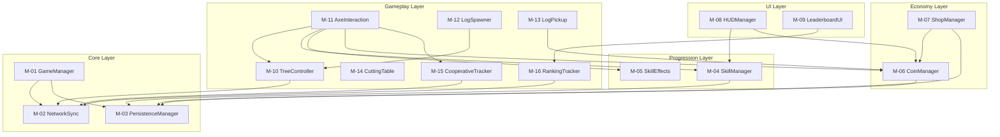

# Technical Design Document (TDD)
**森のきこりキャンプ - VRChatワールド Phase 1 実装設計書**

## 1. Document Info

| **項目** | **内容** |
|---------|---------|
| **System Name** | 森のきこりキャンプ (Woodcutter Camp) |
| **Project Name** | VRChat World - Cooperative Woodcutting Experience |
| **Doc Name** | Technical Design Document (TDD) |
| **Version** | 1.0 |
| **Date** | 2025-11-17 |
| **Author** | VRChat World Development Team |
| **Related Documents** | PLAN.md, PRDv3.md, FSD.md, TSD.md, VRChat_TechResearch_2025.md |
| **Status** | 実装仕様確定 - Work Instruction作成準備完了 |

---

## 2. Purpose & Scope

### 2.1 Purpose (本ドキュメントの目的)

本ドキュメントは、「森のきこりキャンプ」Phase 1の**内部構成を整理し、機能・モジュールを開発しやすい単位に分割**することを目的とします。

具体的には：
- システム全体を**明確なモジュール**に分割し、各モジュールの責務を定義
- 各モジュールを**実装可能な機能単位（Function）**にブレイクダウン
- 各機能を**Work Instruction（作業指示書）**として作成可能な粒度で整理
- 開発チームが**並行作業可能**な依存関係の明確化
- **SOLID原則に準拠**した疎結合設計の実現

### 2.2 Scope (本ドキュメントの範囲)

#### 含まれる範囲
- Phase 1で実装する全6機能（FNC-001〜006）のモジュール設計
- 各モジュールの責務・インターフェース定義
- Work Instruction作成のための機能分割マッピング
- VRChat SDK 3.9.0 / UdonSharp 1.1.9の制約を考慮した技術選定
- Quest最適化を前提としたアーキテクチャ設計

#### 含まれない範囲
- 詳細な実装コード（Work Instructionで記述）
- UI/UXデザインの詳細（FSD.mdに記載済み）
- Phase 2以降の機能（Camp Rank、Combat Systemなど）
- テストケースの詳細（別途テスト計画書で管理）

---

## 3. System Overview

### 3.1 Business / Usage Overview

#### 想定ユーザー
- **プライマリターゲット**: VRChatで「まったり雑談」を好むユーザー、Valheim/Minecraft愛好者
- **セカンダリターゲット**: VRChat初心者、ストリーマー・配信者

#### 主なユースケース
- **UC-01**: プレイヤーが森で木を伐採し、丸太を運搬してコインを獲得する
- **UC-02**: プレイヤーがスキルレベルを上げて、より効率的に作業できるようになる
- **UC-03**: プレイヤーがコインでアイテムを購入し、見た目をカスタマイズする
- **UC-04**: 複数プレイヤーが協力して木を伐採し、ボーナスを得る
- **UC-05**: プレイヤーがランキングで競い、コミュニティ感を楽しむ

### 3.2 High-Level Architecture

```
┌────────────────────────────────────────────────────────────────┐
│                      VRChat Client                             │
│  ┌──────────────────────────────────────────────────────────┐ │
│  │                    Unity Scene                            │ │
│  │  ┌────────────────────────────────────────────────────┐  │ │
│  │  │              UI Layer (M-08, M-09)                 │  │ │
│  │  │  HUDManager, LeaderboardUI, ShopUI                 │  │ │
│  │  └────────────────────────────────────────────────────┘  │ │
│  │                        ↕                                  │ │
│  │  ┌────────────────────────────────────────────────────┐  │ │
│  │  │         Economy Layer (M-06, M-07)                 │  │ │
│  │  │  CoinManager, ShopManager                          │  │ │
│  │  └────────────────────────────────────────────────────┘  │ │
│  │                        ↕                                  │ │
│  │  ┌────────────────────────────────────────────────────┐  │ │
│  │  │      Progression Layer (M-04, M-05)                │  │ │
│  │  │  SkillManager, SkillEffects                        │  │ │
│  │  └────────────────────────────────────────────────────┘  │ │
│  │                        ↕                                  │ │
│  │  ┌────────────────────────────────────────────────────┐  │ │
│  │  │         Gameplay Layer (M-10 ~ M-16)               │  │ │
│  │  │  TreeController, AxeInteraction, LogPickup,        │  │ │
│  │  │  CuttingTable, CooperativeTracker, RankingTracker  │  │ │
│  │  └────────────────────────────────────────────────────┘  │ │
│  │                        ↕                                  │ │
│  │  ┌────────────────────────────────────────────────────┐  │ │
│  │  │           Core Layer (M-01, M-02, M-03)            │  │ │
│  │  │  GameManager, NetworkSync, PersistenceManager      │  │ │
│  │  └────────────────────────────────────────────────────┘  │ │
│  └──────────────────────────────────────────────────────────┘ │
└────────────────────────────────────────────────────────────────┘
                              ↕
┌────────────────────────────────────────────────────────────────┐
│                    VRChat Platform                             │
│  - PlayerData API (100KB制限)                                  │
│  - UdonSync (10KB/秒制限)                                       │
│  - VRC_Pickup (物理インタラクション)                            │
└────────────────────────────────────────────────────────────────┘
```

---

## 4. Module Landscape (全体のモジュール構成)

### 4.1 モジュール一覧

| Module ID | Module Name | Layer | Main Responsibility |
|-----------|-------------|-------|---------------------|
| **M-01** | GameManager | Core | システム全体の初期化・ライフサイクル管理、モジュール間の依存性注入 |
| **M-02** | NetworkSync | Core | UdonSyncedの抽象化、ネットワーク同期の一元管理、帯域制御 |
| **M-03** | PersistenceManager | Core | PlayerDataのI/O抽象化、データバージョン管理、エラーハンドリング |
| **M-04** | SkillManager | Progression | スキルXP・レベル管理、レベルアップ判定、Persistence連携 |
| **M-05** | SkillEffects | Progression | スキル効果の計算（ダメージボーナス、クリティカル率など） |
| **M-06** | CoinManager | Economy | コイン獲得・消費管理、Persistence連携、上限チェック |
| **M-07** | ShopManager | Economy | ショップアイテム管理、購入処理、解禁条件チェック |
| **M-08** | HUDManager | UI | プレイヤーHUD表示（スキル、コイン、通知）、UIアニメーション |
| **M-09** | LeaderboardUI | UI | ランキング表示、リアルタイム更新、ソート処理 |
| **M-10** | TreeController | Gameplay | 木の状態管理（HP、倒木、リスポーン）、ネットワーク同期 |
| **M-11** | AxeInteraction | Gameplay | 斧の攻撃判定、ダメージ計算、エフェクト再生 |
| **M-12** | LogSpawner | Gameplay | 丸太の生成・オブジェクトプール管理、位置計算 |
| **M-13** | LogPickup | Gameplay | 丸太のVRC_Pickup処理、運搬距離計測、納品判定 |
| **M-14** | CuttingTable | Gameplay | 切断台の加工処理、プログレスバー管理、板材生成 |
| **M-15** | CooperativeTracker | Gameplay | 協力伐採の判定・ボーナス計算、タイムスタンプ管理 |
| **M-16** | RankingTracker | Gameplay | プレイヤー統計の収集（伐採数、運搬数）、ネットワーク同期 |

### 4.2 Layer / Area Overview

| Layer / Area Name | Description (役割) | Related Module IDs |
|-------------------|-------------------|-------------------|
| **Core Layer** | システム基盤。他のモジュールに依存せず、基本サービスを提供 | M-01, M-02, M-03 |
| **Progression Layer** | プレイヤーの成長管理。スキルレベル・XP・効果計算 | M-04, M-05 |
| **Economy Layer** | 経済システム。コイン管理・ショップ・購入処理 | M-06, M-07 |
| **UI Layer** | ユーザーインターフェース。HUD・ランキング表示 | M-08, M-09 |
| **Gameplay Layer** | ゲームプレイのコアロジック。伐採・運搬・加工・協力機能 | M-10〜M-16 |

---

## 5. Module Definitions (概要レベル)

### 5.1 Module: M-01 – GameManager

**Responsibility (責務・目的)**
- システム全体の初期化順序を制御する
- 各モジュールのインスタンスを保持し、依存性注入を実現する
- Singletonパターンで全モジュールからアクセス可能にする
- Late Joiner対応のため、初期化を1秒遅延させる

**This module does NOT do (他モジュールに任せること)**
- 個別機能のロジック実装（各モジュールの責務）
- データの永続化（M-03 PersistenceManagerが担当）
- ネットワーク同期（M-02 NetworkSyncが担当）

**Main Functions (大きめの機能単位)**
- F-01: システム初期化（Init All Modules）
- F-02: モジュール参照の提供（Dependency Injection）
- F-03: 初期化エラーハンドリング

**Inputs / Outputs**
- Inputs:
  - From: Unity Start() イベント
  - Data: なし
- Outputs:
  - To: 全モジュール
  - Data: モジュール参照（GameManager.Instance経由）

**Related Data / Entities**
- GameManager自体はデータを持たず、参照のみ保持

**Related Work Instructions (予定)**
- WI-0001: Implement GameManager Singleton and Initialization Order

---

### 5.2 Module: M-02 – NetworkSync

**Responsibility (責務・目的)**
- UdonSyncedの抽象化レイヤーを提供する
- ネットワーク同期のタイミングをバッチング制御し、帯域使用を5KB/秒以下に抑える
- Manual Syncの RequestSerialization() を一元管理する

**This module does NOT do**
- 同期するデータの内容決定（各モジュールが定義）
- ビジネスロジックの実装

**Main Functions**
- F-04: Manual Sync Request Batching
- F-05: 帯域使用量モニタリング
- F-06: Late Joiner OnDeserialization統合

**Inputs / Outputs**
- Inputs:
  - From: 各Gameplayモジュール（M-10〜M-16）
  - Data: 同期リクエスト、データサイズ
- Outputs:
  - To: VRChat UdonSync API
  - Data: RequestSerialization() 呼び出し

**Related Data / Entities**
- `[UdonSynced]` 変数（各モジュールで定義）
- 帯域使用量トラッキング変数

**Related Work Instructions (予定)**
- WI-0002: Implement NetworkSync Batching System
- WI-0003: Implement Bandwidth Monitoring

---

### 5.3 Module: M-03 – PersistenceManager

**Responsibility (責務・目的)**
- PlayerData APIの抽象化レイヤーを提供する
- データのバージョン管理（マイグレーション対応）
- エラーハンドリング（読み込み失敗時のリトライ・フォールバック）
- データサイズの70KB以内制限監視

**This module does NOT do**
- データの内容決定（各モジュールが定義）
- ビジネスロジックの実装

**Main Functions**
- F-07: PlayerData Load with Retry
- F-08: PlayerData Save with Size Check
- F-09: Data Versioning & Migration

**Inputs / Outputs**
- Inputs:
  - From: M-04 SkillManager, M-06 CoinManager
  - Data: 保存するキー・値のペア
- Outputs:
  - To: VRChat PlayerData API
  - Data: SetInt(), GetInt() 呼び出し

**Related Data / Entities**
- PlayerData構造（FSD.md Appendix A参照）

**Related Work Instructions (予定)**
- WI-0004: Implement PersistenceManager with Retry Logic
- WI-0005: Implement Data Versioning System

---

### 5.4 Module: M-04 – SkillManager

**Responsibility (責務・目的)**
- Woodcuttingスキルのレベル・XP管理
- レベルアップ判定とイベント発火
- PlayerDataへの永続化（M-03経由）

**This module does NOT do**
- スキル効果の計算（M-05 SkillEffectsが担当）
- UI表示（M-08 HUDManagerが担当）

**Main Functions**
- F-10: Add XP and Check Level Up
- F-11: Level Up Event Handling
- F-12: Skill Data Persistence

**Inputs / Outputs**
- Inputs:
  - From: M-11 AxeInteraction（木伐採時）
  - Data: 獲得XP量
- Outputs:
  - To: M-05 SkillEffects（レベル参照）
  - To: M-08 HUDManager（UI更新通知）
  - Data: レベルアップイベント

**Related Data / Entities**
- `SkillData`: skillLevel (int), currentXP (int)
- `LevelTable`: レベルごとの必要XP（PRDv3.md参照）

**Related Work Instructions (予定)**
- WI-0006: Implement SkillManager XP System
- WI-0007: Implement Level Up Logic

---

### 5.5 Module: M-05 – SkillEffects

**Responsibility (責務・目的)**
- スキルレベルに応じた効果計算（ダメージボーナス、クリティカル率など）
- 計算式の一元管理

**This module does NOT do**
- レベル・XPの管理（M-04が担当）
- 効果の適用（各モジュールが計算結果を使用）

**Main Functions**
- F-13: Calculate Damage Bonus
- F-14: Calculate Critical Rate
- F-15: Calculate Log Bonus Rate

**Inputs / Outputs**
- Inputs:
  - From: M-04 SkillManager
  - Data: スキルレベル
- Outputs:
  - To: M-11 AxeInteraction（ダメージ計算）
  - Data: ダメージ倍率、クリティカル率

**Related Data / Entities**
- 計算式（PRDv3.md Section 2.2.2参照）

**Related Work Instructions (予定)**
- WI-0008: Implement SkillEffects Calculation

---

### 5.6 Module: M-06 – CoinManager

**Responsibility (責務・目的)**
- きこりコインの獲得・消費管理
- 99,999コイン上限チェック
- PlayerDataへの永続化（M-03経由）

**This module does NOT do**
- ショップアイテム管理（M-07が担当）
- UI表示（M-08が担当）

**Main Functions**
- F-16: Add Coins with Cap Check
- F-17: Deduct Coins for Purchase
- F-18: Coin Data Persistence
- F-19: Daily/First Login Bonus

**Inputs / Outputs**
- Inputs:
  - From: M-11 AxeInteraction（伐採報酬）
  - From: M-13 LogPickup（運搬報酬）
  - From: M-07 ShopManager（購入消費）
- Outputs:
  - To: M-08 HUDManager（残高表示）
  - Data: 現在のコイン数

**Related Data / Entities**
- `CoinData`: currentCoins (int), totalCoinsEarned (int)

**Related Work Instructions (予定)**
- WI-0009: Implement CoinManager Core Logic
- WI-0010: Implement Login Bonus System

---

### 5.7 Module: M-07 – ShopManager

**Responsibility (責務・目的)**
- ショップアイテムの管理（価格、解禁条件、効果）
- 購入処理の実行（残高チェック、解禁条件チェック）
- 購入済みアイテムのPlayerData保存

**This module does NOT do**
- コイン管理（M-06が担当）
- UI表示（M-09 ShopUI - 将来追加）

**Main Functions**
- F-20: Load Shop Items from ScriptableObject
- F-21: Validate Purchase (Coins, Level, Already Owned)
- F-22: Execute Purchase
- F-23: Equip Item

**Inputs / Outputs**
- Inputs:
  - From: Player（ショップUIクリック）
  - Data: アイテムID
- Outputs:
  - To: M-06 CoinManager（コイン消費）
  - To: M-03 PersistenceManager（購入記録保存）
  - Data: 購入成功/失敗

**Related Data / Entities**
- `ShopItem`: itemID, price, requiredLevel, effect
- `PlayerInventory`: unlockedItems[], equippedAxe, equippedHat

**Related Work Instructions (予定)**
- WI-0011: Implement ShopManager Item Database
- WI-0012: Implement Purchase Validation Logic

---

### 5.8 Module: M-08 – HUDManager

**Responsibility (責務・目的)**
- プレイヤーのHUD表示（スキルレベル、XPバー、コイン残高、通知）
- UIアニメーション（カウントアップ、フェードイン/アウト）

**This module does NOT do**
- データ管理（各モジュールから取得）
- ゲームロジック

**Main Functions**
- F-24: Update Skill Display
- F-25: Update Coin Display
- F-26: Show Notification (XP獲得、コイン獲得、レベルアップ)
- F-27: HUD Settings (透明度、サイズ、位置調整)

**Inputs / Outputs**
- Inputs:
  - From: M-04 SkillManager（レベル・XP）
  - From: M-06 CoinManager（コイン残高）
- Outputs:
  - To: Unity UI Canvas
  - Data: テキスト、プログレスバー、アニメーション

**Related Data / Entities**
- UI要素のみ（データは持たない）

**Related Work Instructions (予定)**
- WI-0013: Implement HUDManager UI Update System
- WI-0014: Implement Notification Animation

---

### 5.9 Module: M-09 – LeaderboardUI

**Responsibility (責務・目的)**
- ランキングボードのUI表示
- 30秒ごとのリアルタイム更新
- TOP3のハイライト表示

**This module does NOT do**
- ランキングデータの収集（M-16が担当）
- ソート処理（M-16が担当）

**Main Functions**
- F-28: Display Top 3 Rankings
- F-29: Update Ranking Every 30 Seconds
- F-30: Highlight Player Position

**Inputs / Outputs**
- Inputs:
  - From: M-16 RankingTracker
  - Data: TOP3のプレイヤー名・伐採数
- Outputs:
  - To: Unity UI Canvas（3D WorldSpace）
  - Data: テキスト表示

**Related Data / Entities**
- ランキング表示用UIコンポーネント

**Related Work Instructions (予定)**
- WI-0015: Implement LeaderboardUI Display

---

### 5.10 Module: M-10 – TreeController

**Responsibility (責務・目的)**
- 木の状態管理（HP、倒木フラグ、リスポーンタイマー）
- ネットワーク同期（Manual Sync）
- 倒木アニメーションの制御

**This module does NOT do**
- ダメージ計算（M-11が担当）
- 丸太生成（M-12が担当）

**Main Functions**
- F-31: Take Damage from Axe
- F-32: Start Falling Animation
- F-33: Respawn Tree after Timer
- F-34: Sync Tree State (HP, isFallen, respawnTimer)

**Inputs / Outputs**
- Inputs:
  - From: M-11 AxeInteraction
  - Data: ダメージ量、攻撃者の位置
- Outputs:
  - To: M-12 LogSpawner（倒木完了イベント）
  - To: M-02 NetworkSync（同期リクエスト）
  - Data: 木の状態変化

**Related Data / Entities**
- `Tree`: treeID, treeType, currentHP, maxHP, state, respawnTimer

**Related Work Instructions (予定)**
- WI-0016: Implement TreeController State Machine
- WI-0017: Implement Tree Falling Animation
- WI-0018: Implement Tree Respawn System

---

### 5.11 Module: M-11 – AxeInteraction

**Responsibility (責務・目的)**
- 斧のスイング判定（VR/デスクトップ対応）
- 木へのヒット判定（コライダー衝突）
- ダメージ計算（スキル効果、協力ボーナス、クリティカル）
- エフェクト・サウンド再生

**This module does NOT do**
- 木の状態管理（M-10が担当）
- スキル管理（M-04が担当）

**Main Functions**
- F-35: Detect Axe Swing (VR Trigger / Desktop Click)
- F-36: Collision Detection with Tree
- F-37: Calculate Damage with Skill Effects
- F-38: Play Hit Effects (Particles, Sound)
- F-39: Award XP and Coins

**Inputs / Outputs**
- Inputs:
  - From: Player Input（トリガー、クリック）
  - From: M-05 SkillEffects（ダメージボーナス）
  - From: M-15 CooperativeTracker（協力ボーナス）
- Outputs:
  - To: M-10 TreeController（ダメージ通知）
  - To: M-04 SkillManager（XP付与）
  - To: M-06 CoinManager（コイン付与）
  - Data: ダメージ量、獲得XP、獲得コイン

**Related Data / Entities**
- `Axe`: axeID, baseDamage, attackSpeed, criticalRate

**Related Work Instructions (予定)**
- WI-0019: Implement Axe Swing Detection
- WI-0020: Implement Damage Calculation System
- WI-0021: Implement Hit Effects

---

### 5.12 Module: M-12 – LogSpawner

**Responsibility (責務・目的)**
- 丸太のスポーン処理
- オブジェクトプール管理（最大30個制限）
- 生成位置・力の計算

**This module does NOT do**
- 木の状態管理（M-10が担当）
- Pickup処理（M-13が担当）

**Main Functions**
- F-40: Spawn Logs from Fallen Tree
- F-41: Object Pool Management (Max 30)
- F-42: Calculate Spawn Position and Force

**Inputs / Outputs**
- Inputs:
  - From: M-10 TreeController（倒木完了イベント）
  - Data: 木の種類、位置
- Outputs:
  - To: Unity Scene（GameObject生成）
  - Data: 丸太オブジェクト

**Related Data / Entities**
- `Log`: logID, spawnTime, position, isPickedUp

**Related Work Instructions (予定)**
- WI-0022: Implement LogSpawner with Object Pool

---

### 5.13 Module: M-13 – LogPickup

**Responsibility (責務・目的)**
- VRC_Pickupの実装
- 運搬距離の計測
- 納品ゾーン判定とコイン報酬

**This module does NOT do**
- コイン管理（M-06が担当）
- オブジェクトプール管理（M-12が担当）

**Main Functions**
- F-43: OnPickup Event Handling
- F-44: Track Carrying Distance
- F-45: OnDrop Event and Delivery Zone Check
- F-46: Calculate Coin Reward (3 coins per 10m, max 30)

**Inputs / Outputs**
- Inputs:
  - From: Player（VRC_Pickupイベント）
  - Data: Pickup/Drop位置
- Outputs:
  - To: M-06 CoinManager（コイン付与）
  - Data: 運搬距離、獲得コイン

**Related Data / Entities**
- `LogPickup`: pickupStartPosition, carriedDistance

**Related Work Instructions (予定)**
- WI-0023: Implement LogPickup VRC_Pickup System
- WI-0024: Implement Delivery Zone and Reward Calculation

---

### 5.14 Module: M-14 – CuttingTable

**Responsibility (責務・目的)**
- 切断台の加工処理
- プログレスバー管理
- 板材生成

**This module does NOT do**
- Pickup処理（M-13が担当）
- クラフトレシピ管理（Phase 2）

**Main Functions**
- F-47: Detect Log Placement on Table
- F-48: Start Processing with Progress Bar
- F-49: Spawn Plank Items

**Inputs / Outputs**
- Inputs:
  - From: Player（丸太配置、ボタンクリック）
  - Data: 配置された丸太ID
- Outputs:
  - To: Unity Scene（板材オブジェクト生成）
  - Data: 板材オブジェクト

**Related Data / Entities**
- `CuttingTable`: isProcessing, placedLogID, processStartTime

**Related Work Instructions (予定)**
- WI-0025: Implement CuttingTable Processing System

---

### 5.15 Module: M-15 – CooperativeTracker

**Responsibility (責務・目的)**
- 協力伐採の判定（3秒以内の複数攻撃）
- ボーナス計算（+20%）
- ネットワーク同期（タイムスタンプ）

**This module does NOT do**
- ダメージ計算（M-11が担当）
- UI表示（M-08が担当）

**Main Functions**
- F-50: Track Attack Timestamps per Player
- F-51: Detect Cooperative Chopping (2+ players within 3s)
- F-52: Calculate Bonus (Damage +20%, XP +20%)
- F-53: Sync Cooperative State

**Inputs / Outputs**
- Inputs:
  - From: M-11 AxeInteraction（攻撃イベント）
  - Data: プレイヤーID、木ID、タイムスタンプ
- Outputs:
  - To: M-11 AxeInteraction（ボーナス倍率）
  - To: M-02 NetworkSync（同期リクエスト）
  - Data: 協力ボーナス有効フラグ

**Related Data / Entities**
- `[UdonSynced] int[] lastHitTimestamp`
- `[UdonSynced] int[] targetTreeID`

**Related Work Instructions (予定)**
- WI-0026: Implement CooperativeTracker Detection System

---

### 5.16 Module: M-16 – RankingTracker

**Responsibility (責務・目的)**
- プレイヤー統計の収集（伐採数、運搬数、コイン獲得数）
- ネットワーク同期
- TOP3のソート処理（30秒ごと）

**This module does NOT do**
- UI表示（M-09が担当）
- データ永続化（インスタンス内のみ）

**Main Functions**
- F-54: Record Player Statistics (Trees Cut, Logs Carried)
- F-55: Sort and Calculate Top 3
- F-56: Sync Ranking Data Every 30 Seconds

**Inputs / Outputs**
- Inputs:
  - From: M-11 AxeInteraction（伐採完了）
  - From: M-13 LogPickup（運搬完了）
  - Data: プレイヤーID、アクション種別
- Outputs:
  - To: M-09 LeaderboardUI（TOP3データ）
  - To: M-02 NetworkSync（同期リクエスト）
  - Data: ランキングデータ

**Related Data / Entities**
- `[UdonSynced] string[] playerNames`
- `[UdonSynced] int[] playerCutCounts`

**Related Work Instructions (予定)**
- WI-0027: Implement RankingTracker Data Collection
- WI-0028: Implement Top 3 Sorting Algorithm

---

## 6. Function Breakdown for Work Instructions

### 6.1 Function List

| Function ID | Function Name | Module ID | Summary |
|-------------|---------------|-----------|---------|
| F-01 | Init All Modules | M-01 | システム全体の初期化順序制御 |
| F-02 | Dependency Injection | M-01 | モジュール参照の提供 |
| F-03 | Initialization Error Handling | M-01 | 初期化エラー処理 |
| F-04 | Manual Sync Request Batching | M-02 | Manual Sync のバッチング制御 |
| F-05 | Bandwidth Monitoring | M-02 | 帯域使用量モニタリング |
| F-06 | Late Joiner OnDeserialization | M-02 | Late Joiner 同期統合 |
| F-07 | PlayerData Load with Retry | M-03 | データ読み込み＋リトライ |
| F-08 | PlayerData Save with Size Check | M-03 | データ保存＋サイズチェック |
| F-09 | Data Versioning & Migration | M-03 | データバージョン管理 |
| F-10 | Add XP and Check Level Up | M-04 | XP加算＋レベルアップ判定 |
| F-11 | Level Up Event Handling | M-04 | レベルアップイベント処理 |
| F-12 | Skill Data Persistence | M-04 | スキルデータ永続化 |
| F-13 | Calculate Damage Bonus | M-05 | ダメージボーナス計算 |
| F-14 | Calculate Critical Rate | M-05 | クリティカル率計算 |
| F-15 | Calculate Log Bonus Rate | M-05 | 丸太生成数ボーナス計算 |
| F-16 | Add Coins with Cap Check | M-06 | コイン加算＋上限チェック |
| F-17 | Deduct Coins for Purchase | M-06 | コイン消費処理 |
| F-18 | Coin Data Persistence | M-06 | コインデータ永続化 |
| F-19 | Daily/First Login Bonus | M-06 | ログインボーナス |
| F-20 | Load Shop Items | M-07 | ショップアイテム読み込み |
| F-21 | Validate Purchase | M-07 | 購入バリデーション |
| F-22 | Execute Purchase | M-07 | 購入実行 |
| F-23 | Equip Item | M-07 | アイテム装備 |
| F-24 | Update Skill Display | M-08 | スキル表示更新 |
| F-25 | Update Coin Display | M-08 | コイン表示更新 |
| F-26 | Show Notification | M-08 | 通知表示 |
| F-27 | HUD Settings | M-08 | HUD設定 |
| F-28 | Display Top 3 Rankings | M-09 | TOP3表示 |
| F-29 | Update Ranking Every 30s | M-09 | ランキング定期更新 |
| F-30 | Highlight Player Position | M-09 | プレイヤー位置ハイライト |
| F-31 | Take Damage from Axe | M-10 | 木のダメージ処理 |
| F-32 | Start Falling Animation | M-10 | 倒木アニメーション |
| F-33 | Respawn Tree | M-10 | 木のリスポーン |
| F-34 | Sync Tree State | M-10 | 木の状態同期 |
| F-35 | Detect Axe Swing | M-11 | 斧スイング判定 |
| F-36 | Collision Detection | M-11 | コライダー衝突判定 |
| F-37 | Calculate Damage | M-11 | ダメージ計算 |
| F-38 | Play Hit Effects | M-11 | ヒットエフェクト |
| F-39 | Award XP and Coins | M-11 | XP・コイン付与 |
| F-40 | Spawn Logs | M-12 | 丸太スポーン |
| F-41 | Object Pool Management | M-12 | オブジェクトプール管理 |
| F-42 | Calculate Spawn Position | M-12 | スポーン位置計算 |
| F-43 | OnPickup Event | M-13 | Pickupイベント処理 |
| F-44 | Track Carrying Distance | M-13 | 運搬距離計測 |
| F-45 | OnDrop and Delivery Check | M-13 | Drop＋納品判定 |
| F-46 | Calculate Coin Reward | M-13 | コイン報酬計算 |
| F-47 | Detect Log Placement | M-14 | 丸太配置判定 |
| F-48 | Start Processing | M-14 | 加工処理開始 |
| F-49 | Spawn Plank Items | M-14 | 板材生成 |
| F-50 | Track Attack Timestamps | M-15 | 攻撃タイムスタンプ記録 |
| F-51 | Detect Cooperative Chopping | M-15 | 協力伐採判定 |
| F-52 | Calculate Bonus | M-15 | ボーナス計算 |
| F-53 | Sync Cooperative State | M-15 | 協力状態同期 |
| F-54 | Record Player Statistics | M-16 | プレイヤー統計記録 |
| F-55 | Sort Top 3 | M-16 | TOP3ソート |
| F-56 | Sync Ranking Data | M-16 | ランキングデータ同期 |

### 6.2 Function → Work Instruction Mapping (Plan)

| WI ID | Tentative Title | Module | Functions | Priority | Dependencies | Estimated Days |
|-------|----------------|--------|-----------|----------|-------------|---------------|
| **Phase 0: 基盤実装（Week 1）** |
| WI-0001 | Implement GameManager Singleton | M-01 | F-01, F-02, F-03 | 最高 | なし | 1 |
| WI-0002 | Implement NetworkSync Batching | M-02 | F-04, F-05 | 最高 | WI-0001 | 1 |
| WI-0003 | Implement PersistenceManager | M-03 | F-07, F-08, F-09 | 最高 | WI-0001 | 2 |
| WI-0004 | Setup Late Joiner Handling | M-02 | F-06 | 高 | WI-0002 | 0.5 |
| **Phase 1: コア機能（Week 2-3）** |
| WI-0005 | Implement SkillManager | M-04 | F-10, F-11, F-12 | 最高 | WI-0003 | 1.5 |
| WI-0006 | Implement SkillEffects | M-05 | F-13, F-14, F-15 | 最高 | WI-0005 | 0.5 |
| WI-0007 | Implement TreeController State | M-10 | F-31, F-34 | 最高 | WI-0002 | 2 |
| WI-0008 | Implement Tree Falling Animation | M-10 | F-32, F-33 | 高 | WI-0007 | 1 |
| WI-0009 | Implement AxeInteraction Detection | M-11 | F-35, F-36 | 最高 | WI-0006 | 1.5 |
| WI-0010 | Implement Damage Calculation | M-11 | F-37, F-39 | 最高 | WI-0009 | 1 |
| WI-0011 | Implement Hit Effects | M-11 | F-38 | 中 | WI-0010 | 0.5 |
| WI-0012 | Implement LogSpawner | M-12 | F-40, F-41, F-42 | 最高 | WI-0007 | 1.5 |
| **Phase 2: 補助機能（Week 4）** |
| WI-0013 | Implement CoinManager | M-06 | F-16, F-17, F-18 | 最高 | WI-0003 | 1 |
| WI-0014 | Implement Login Bonus | M-06 | F-19 | 中 | WI-0013 | 0.5 |
| WI-0015 | Implement LogPickup VRC_Pickup | M-13 | F-43, F-44 | 最高 | WI-0013 | 1 |
| WI-0016 | Implement Delivery Zone | M-13 | F-45, F-46 | 最高 | WI-0015 | 1 |
| WI-0017 | Implement HUDManager | M-08 | F-24, F-25, F-26 | 高 | WI-0005, WI-0013 | 1.5 |
| WI-0018 | Implement HUD Settings | M-08 | F-27 | 低 | WI-0017 | 0.5 |
| WI-0019 | Implement ShopManager | M-07 | F-20, F-21, F-22, F-23 | 高 | WI-0013 | 2 |
| WI-0020 | Implement CooperativeTracker | M-15 | F-50, F-51, F-52, F-53 | 高 | WI-0010, WI-0002 | 1.5 |
| WI-0021 | Implement RankingTracker | M-16 | F-54, F-55, F-56 | 中 | WI-0002 | 1 |
| WI-0022 | Implement LeaderboardUI | M-09 | F-28, F-29, F-30 | 中 | WI-0021 | 1 |
| WI-0023 | Implement CuttingTable | M-14 | F-47, F-48, F-49 | 低 | WI-0012 | 1.5 |
| **Phase 3: 統合テスト・最適化（Week 5）** |
| WI-0024 | Performance Optimization | 全モジュール | - | 高 | 全WI完了 | 2 |
| WI-0025 | Quest Build & Testing | 全モジュール | - | 最高 | WI-0024 | 1 |

**合計**: 25 Work Instructions、推定26日（約5週間）

---

## 7. Data & Interface Overview

### 7.1 Main Data Models / Entities

| Entity Name | Description | Related Modules | Storage |
|-------------|-------------|----------------|---------|
| **PlayerData** | プレイヤーの永続データ | M-03, M-04, M-06, M-07 | VRChat PlayerData API |
| **Tree** | 木の状態 | M-10 | UdonSynced + Local |
| **Log** | 丸太オブジェクト | M-12, M-13 | Local |
| **SkillData** | スキルレベル・XP | M-04 | PlayerData |
| **CoinData** | コイン残高・累計 | M-06 | PlayerData |
| **ShopItem** | ショップアイテム | M-07 | ScriptableObject |
| **RankingData** | ランキング統計 | M-16 | UdonSynced |

### 7.2 Main APIs / Interfaces

| API / Interface ID | Name / Path | Caller | Provider | Summary |
|--------------------|------------|--------|----------|---------|
| **API-01** | `GameManager.Instance.GetSkillManager()` | 各モジュール | M-01 | SkillManager参照取得 |
| **API-02** | `NetworkSync.RequestStatUpdate()` | M-10〜M-16 | M-02 | ネットワーク同期リクエスト |
| **API-03** | `PersistenceManager.SaveInt(key, value)` | M-04, M-06 | M-03 | PlayerData保存 |
| **API-04** | `SkillManager.AddXP(amount)` | M-11 | M-04 | XP加算 |
| **API-05** | `SkillEffects.GetDamageBonus()` | M-11 | M-05 | ダメージボーナス取得 |
| **API-06** | `CoinManager.AddCoins(amount)` | M-11, M-13 | M-06 | コイン加算 |
| **API-07** | `TreeController.TakeDamage(damage, attacker)` | M-11 | M-10 | 木にダメージを与える |
| **VRC-01** | `PlayerData.SetInt()` | M-03 | VRChat SDK | PlayerData保存 |
| **VRC-02** | `PlayerData.GetInt()` | M-03 | VRChat SDK | PlayerData読み込み |
| **VRC-03** | `RequestSerialization()` | M-02 | VRChat SDK | Manual Sync実行 |
| **VRC-04** | `VRC_Pickup.OnPickup()` | M-13 | VRChat SDK | Pickupイベント |

---

## 8. Constraints / Guidelines for Implementation

### 8.1 Tech Stack & Versions

| Component | Version | License | Note |
|-----------|---------|---------|------|
| **Unity** | 2022.3.22f1 LTS | Proprietary | VRChat公式サポート版 |
| **VRChat SDK** | 3.9.0 | VRChat EULA | 最新安定版 |
| **UdonSharp** | 1.1.9 | MIT | 安定版（1.2.0-beta1は不使用） |
| **ClientSim** | 1.2.7 | VRChat SDK | ローカルテスト用 |
| **VCC** | 2.4.0 | - | パッケージ管理 |
| **C#** | 7.3 | - | Unity 2022.3対応 |

### 8.2 Coding Guidelines

#### 命名規則
```csharp
// クラス名: PascalCase
public class GameManager : UdonSharpBehaviour

// パブリックメソッド: Udon CustomEvent用に "_" プレフィックス + PascalCase
public void _Initialize()
public void _TakeDamage(int damage, VRCPlayerApi attacker)

// プライベートメソッド: PascalCase
private void InitializeComponents()

// 変数: camelCase
private float nextUpdateTime;
private TreeController treeController;

// UdonSynced変数: camelCase + 型プレフィックス
[UdonSynced] private int[] playerCutCounts;
[UdonSynced] private bool isFallen;

// 定数: UPPER_CASE
private const int MAX_PLAYERS = 20;
private const float UPDATE_INTERVAL = 5.0f;
```

#### エラーハンドリング方針
```csharp
// 1. Null チェック
if (treeController == null)
{
    Debug.LogError("[AxeInteraction] TreeController reference is null");
    return;
}

// 2. 範囲チェック
if (damage < 0 || damage > 1000)
{
    Debug.LogWarning($"[TreeController] Invalid damage: {damage}. Clamping to 0-1000");
    damage = Mathf.Clamp(damage, 0, 1000);
}

// 3. PlayerDataエラー処理（M-03で一元管理）
try
{
    PlayerData.SetInt(key, value);
}
catch
{
    if (retryCount < MAX_RETRIES)
    {
        SendCustomEventDelayedSeconds(nameof(_RetrySave), 1.0f);
    }
}
```

#### パフォーマンス最適化ルール
```csharp
// ✅ Good: GetComponent を Start() で1回のみ
void Start()
{
    treeController = GetComponent<TreeController>();
    skillManager = GameObject.Find("GameManager").GetComponent<SkillManager>();
}

// ❌ Bad: 毎フレーム GetComponent
void Update()
{
    var tree = GetComponent<TreeController>(); // 毎フレーム実行で遅い
}

// ✅ Good: Update() 回避、タイマーベース
private float nextCheckTime = 0;
void Update()
{
    if (Time.time >= nextCheckTime)
    {
        CheckStatus();
        nextCheckTime = Time.time + checkInterval;
    }
}

// ✅ Good: イベント駆動
public void _OnTreeHit() // 外部から呼ばれる
{
    ProcessHit();
}
```

#### ログ出力規約
```csharp
// [ModuleName] プレフィックス + メッセージ
Debug.Log("[GameManager] Initialization completed");
Debug.LogWarning("[SkillManager] Player level is already at max (Lv10)");
Debug.LogError("[PersistenceManager] Failed to save PlayerData after 3 retries");
```

### 8.3 Other Constraints

#### Performance
- **Quest 2環境で60fps維持**（10人同時接続時）
- **メモリ使用量**: ワールド全体で100MB以下
- **ネットワーク帯域**: 5KB/秒以下（制限の50%）
- **レスポンス**: 主要操作（斧スイング、ダメージ計算）を100ms以内

#### Security
- **Master Client検証**: ダメージ処理はMaster Clientのみ実行
- **異常値チェック**: ダメージ1000以上は自動拒否
- **PlayerDataサイズ**: 70KB以内監視

#### Network Sync
- **Manual Sync優先**: Continuous Syncは使用しない
- **バッチング**: 同期リクエストを5秒間隔でまとめる
- **Late Joiner対応**: 初期化を1秒遅延

#### Logging
- **デバッグログ**: 開発時は全モジュールでDebug.Log出力
- **本番ビルド**: エラーログのみ残す（Warning/Logは削除）

---

## 9. Open Questions / ToDo for Design

### 9.1 Open Questions

- **Q1**: Soba言語（2024年11月発表）への移行時期は？
  - **回答**: Phase 1はUdonSharp 1.1.9で実装。Sobaは2025年中にEarly Access予定のため、Phase 2以降で検討。

- **Q2**: SDK 3.9.1-beta（World PhysBones対応）を使用するか？
  - **回答**: Phase 1は安定版3.9.0を使用。Phase 2でPhysBones検討。

- **Q3**: 協力伐採のネットワーク同期でLate Joinerがタイムスタンプずれる問題への対応は？
  - **回答**: OnDeserializationでローカル時刻との差分を計算し、補正する。

### 9.2 ToDo for Design

- [ ] **ショップUIの詳細設計**（M-07のUIコンポーネント）→ WI-0019作成前に必要
- [ ] **プログレスバーのUI設計**（M-14 CuttingTable）→ WI-0023作成前に必要
- [ ] **オブジェクトプールのサイズ調整**（M-12）→ Quest負荷テスト後に決定
- [ ] **ランキングソートアルゴリズム最適化**（M-16）→ 20人分のソートを10ms以内で完了できるか検証

---

## 10. 付録

### 10.1 モジュール依存関係図



### 10.2 FSD機能とモジュールのマッピング

| FSD機能ID | 機能名 | 担当モジュール |
|-----------|-------|---------------|
| FNC-001 | 伐採システム | M-10, M-11, M-12, M-15 |
| FNC-002 | 運搬システム | M-13 |
| FNC-003 | 加工システム | M-14 |
| FNC-004 | スキル成長システム | M-04, M-05 |
| FNC-005 | 経済システム | M-06, M-07 |
| FNC-006 | 協力・ソーシャル機能 | M-15, M-16, M-09 |

### 10.3 技術仕様サマリ（VRChat_TechResearch_2025.mdより抜粋）

#### PlayerData制限
- 容量: 100KB/Player/World（PlayerData）
- 追加: 100KB（Player Objects）
- 合計: 200KB制限
- 本プロジェクト目標: 70KB以内（70%使用）

#### ネットワーク同期
- Continuous Sync: 約200バイト/回、50Hz自動送信
- Manual Sync: 約282KB/回、RequestSerialization()必須
- 帯域制限: 4-6 KB/秒（全体）
- 本プロジェクト目標: 5KB/秒以内（50%使用）

#### Quest最適化
- ポリゴン予算: 10,000三角形（ワールド全体）
- テクスチャ: 1024x1024最大、ASTC圧縮
- メモリ: 100MB以下
- MSAA: 4x（固定）

### 10.4 参考資料

- **公式ドキュメント**:
  - [VRChat Creator Hub](https://creators.vrchat.com/)
  - [VRChat SDK 3.9.0 Release Notes](https://creators.vrchat.com/releases/release-3-9-0/)
  - [UdonSharp Documentation](https://udonsharp.docs.vrchat.com/)

- **プロジェクト内ドキュメント**:
  - PLAN.md - プロジェクト企画書
  - PRDv3.md - Phase 1詳細仕様書
  - FSD.md - 機能仕様書（FNC-001〜006）
  - TSD.md - 技術仕様書（アーキテクチャ詳細）
  - VRChat_TechResearch_2025.md - 最新技術調査レポート
  - TECHNICAL_DETAILS.md - 技術詳細・コード例集

---

**ドキュメント管理情報**
- 作成日: 2025-11-17
- バージョン: 1.0
- ステータス: 実装仕様確定 - Work Instruction作成準備完了
- 次回レビュー: Phase 0実装完了後（Week 1終了時）

---

**承認**
- [ ] アーキテクチャレビュー承認
- [ ] モジュール分割承認
- [ ] Work Instruction作成開始承認

---
