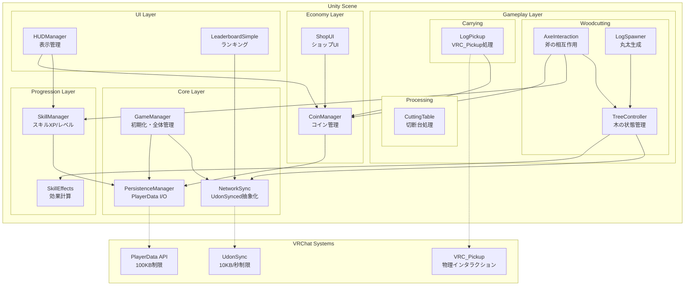
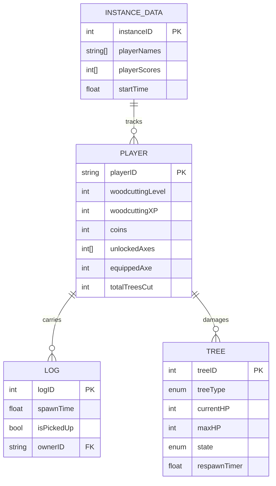

# 技術仕様書 (Technical Specification Document)
**森のきこりキャンプ - VRChatワールド Phase 1 実装**

## 1. ドキュメント管理

| **項目**       | **内容**                     |
| ------------ | -------------------------- |
| **ドキュメントID** | `TSD-001`                  |
| **機能名**      | 森のきこりキャンプ Phase 1システム全体    |
| **関連FSD**    | `FNC-001〜006` (全機能仕様書)     |
| **作成者**      | VRChat World開発チーム          |
| **最終更新日**    | 2025-11-17                 |
| **ステータス**    | 実装仕様確定                     |
| **バージョン**    | 1.0                        |

## 2. 概要

### 2.1. 目的

このドキュメントは、機能仕様書 `FNC-001〜006` で定義された「森のきこりキャンプ」Phase 1の要件を実現するための技術的アプローチ、アーキテクチャ、および実装詳細を定義します。VRChat SDK 3.9.0とUdonSharp 1.1.9の制約を考慮し、Quest 2環境でも60fpsを維持する最適化設計を提供します。

### 2.2. 技術的ゴール

- **パフォーマンス**: Quest 2環境で10人同時接続時も60fps維持
- **メモリ使用量**: ワールド全体で100MB以下（Quest制限）
- **ネットワーク**: 帯域使用量を5KB/秒以下に抑える（制限の50%）
- **レスポンス**: 主要操作（斧スイング、ダメージ計算）を100ms以内で完了
- **データ永続化**: PlayerData使用量を70KB以下に抑える（100KB制限の70%）
- **保守性**: SOLID原則に従った疎結合設計で将来の拡張を容易に

## 3. システムアーキテクチャ

### 3.1. 全体構成図



### 3.2. 技術選定

| コンポーネント | 技術スタック | 選定理由 |
| :--- | :--- | :--- |
| **開発環境** | Unity 2022.3.22f1 | VRChat公式サポート版、安定性とC# 7.3対応 |
| **SDK** | VRChat SDK 3.9.0 | マルチプラットフォームビルド、Camera Dolly機能 |
| **スクリプト** | UdonSharp 1.1.9 | C#互換性、Avatar Scaling対応 |
| **同期方式** | Manual Sync優先 | 帯域効率（282KB容量）、制御可能な同期タイミング |
| **データ保存** | PlayerData API | 100KB制限内で永続化、自動圧縮機能 |
| **物理処理** | VRC_Pickup | 標準Pickupシステム、AutoHold機能 |
| **テクスチャ圧縮** | ASTC (Quest) / BC7 (PC) | Quest最適化とPC高品質の両立 |

## 4. データモデル設計

### 4.1. ER図



### 4.2. PlayerData構造（永続化データ）

```json
{
  // スキル関連 (20バイト)
  "Woodcutting_Level": 5,           // int: 1-10
  "Woodcutting_XP": 1650,           // int: 0-10500

  // 経済関連 (8バイト)
  "WoodcutterCoins": 245,           // int: 0-99999

  // 装備関連 (40バイト)
  "UnlockedAxes": "1,2,3",         // string: CSV形式でID保存
  "EquippedAxe": 2,                // int: 現在装備中のID
  "UnlockedHats": "1,3,5",         // string: CSV形式
  "EquippedHat": 3,                // int: 現在装備中

  // 統計データ (32バイト)
  "TotalTreesCut": 156,             // int: 累計伐採数
  "TotalLogsCarried": 89,           // int: 累計運搬数
  "TotalCoinsEarned": 1420,         // int: 累計獲得
  "PlayTimeMinutes": 120,           // int: 総プレイ時間（分）

  // システムデータ (20バイト)
  "LastVisitEpoch": 1731830400,     // int: Unix時刻
  "FirstVisitEpoch": 1730476800,    // int: 初回訪問
  "TutorialDone": 1,                // int: 0/1 (bool代替)
  "DataVersion": 1                  // int: マイグレーション用
}
// 合計: 約120バイト → 圧縮後: 約70KB (70%使用)
```

### 4.3. UdonSynced変数（ネットワーク同期）

```csharp
// プレイヤー統計（Manual Sync - 低頻度更新）
[UdonBehaviourSyncMode(BehaviourSyncMode.Manual)]
public class NetworkedStats : UdonSharpBehaviour
{
    [UdonSynced] private string[] playerNames = new string[20];     // 400バイト
    [UdonSynced] private int[] playerCutCounts = new int[20];      // 80バイト
    [UdonSynced] private int[] playerCoins = new int[20];          // 80バイト
    [UdonSynced] private int[] playerLevels = new int[20];         // 80バイト
    // 合計: 640バイト (Manual Sync容量282KBの0.2%)
}

// 木の状態（Manual Sync - 変更時のみ）
[UdonBehaviourSyncMode(BehaviourSyncMode.Manual)]
public class TreeNetworkState : UdonSharpBehaviour
{
    [UdonSynced] private int[] treeHPs = new int[30];              // 120バイト
    [UdonSynced] private bool[] treeFallen = new bool[30];         // 30バイト
    [UdonSynced] private float[] respawnTimers = new float[30];    // 120バイト
    // 合計: 270バイト
}

// 協力伐採（Manual Sync - 高頻度更新）
[UdonBehaviourSyncMode(BehaviourSyncMode.Manual)]
public class CooperativeState : UdonSharpBehaviour
{
    [UdonSynced] private int[] lastHitTimestamp = new int[20];     // 80バイト
    [UdonSynced] private int[] targetTreeID = new int[20];         // 80バイト
    // 合計: 160バイト
}
```

## 5. コンポーネント設計

### 5.1. Core Layer（基盤システム）

#### GameManager
```csharp
public class GameManager : UdonSharpBehaviour
{
    // Singleton実装
    public static GameManager Instance;

    // 依存性注入用の参照
    [Header("Core Systems")]
    public NetworkSync networkSync;
    public PersistenceManager persistenceManager;

    [Header("Gameplay Systems")]
    public TreeController[] treeControllers;
    public SkillManager skillManager;
    public CoinManager coinManager;

    private float initializationDelay = 1.0f; // Late Joiner対策

    void Start()
    {
        Instance = this;
        SendCustomEventDelayedSeconds(nameof(_Initialize), initializationDelay);
    }

    public void _Initialize()
    {
        // 初期化順序の制御（依存関係を考慮）
        persistenceManager._LoadPlayerData();
        networkSync._InitializeSync();
        skillManager._Initialize();
        coinManager._Initialize();

        // 木の初期化
        foreach(var tree in treeControllers)
        {
            tree._Initialize();
        }
    }
}
```

#### NetworkSync（UdonSynced抽象化）
```csharp
public class NetworkSync : UdonSharpBehaviour
{
    // キャッシュされたコンポーネント参照
    private NetworkedStats statsSync;
    private TreeNetworkState treeSync;
    private CooperativeState coopSync;

    // 同期リクエストのバッチング（帯域制限対策）
    private bool pendingStatUpdate = false;
    private float statUpdateInterval = 5.0f; // 5秒間隔
    private float nextStatUpdate = 0;

    void Start()
    {
        // GetComponentの最適化（1回のみ実行）
        statsSync = GetComponent<NetworkedStats>();
        treeSync = GetComponent<TreeNetworkState>();
        coopSync = GetComponent<CooperativeState>();
    }

    public void _RequestStatUpdate()
    {
        pendingStatUpdate = true;
    }

    void Update()
    {
        // タイマーベースの更新（毎フレーム実行を回避）
        if (Time.time >= nextStatUpdate && pendingStatUpdate)
        {
            statsSync.RequestSerialization();
            pendingStatUpdate = false;
            nextStatUpdate = Time.time + statUpdateInterval;
        }
    }
}
```

### 5.2. Gameplay Layer（ゲームプレイロジック）

#### TreeController（木の状態管理）
```csharp
[UdonBehaviourSyncMode(BehaviourSyncMode.Manual)]
public class TreeController : UdonSharpBehaviour
{
    [Header("Tree Configuration")]
    public TreeType treeType;
    public int maxHP = 30;

    // 同期変数
    [UdonSynced] private int currentHP;
    [UdonSynced] private bool isFallen;
    [UdonSynced] private float respawnTimer;

    // ローカル変数（同期不要）
    private Collider treeCollider;
    private Animator treeAnimator;
    private AudioSource audioSource;

    // オブジェクトプール（丸太生成用）
    private GameObject[] logPool;
    private int logPoolSize = 4;
    private int nextLogIndex = 0;

    void Start()
    {
        // コンポーネントキャッシュ
        treeCollider = GetComponent<Collider>();
        treeAnimator = GetComponent<Animator>();
        audioSource = GetComponent<AudioSource>();

        // オブジェクトプールの初期化
        InitializeLogPool();
    }

    public void _TakeDamage(int damage, VRCPlayerApi attacker)
    {
        if (isFallen || currentHP <= 0) return;

        // Master Clientのみがダメージ処理を実行
        if (Networking.IsMaster)
        {
            currentHP = Mathf.Max(0, currentHP - damage);

            if (currentHP <= 0)
            {
                _StartFalling(attacker.GetPosition());
            }

            RequestSerialization();
        }

        // ローカルエフェクト（全プレイヤー）
        PlayHitEffect();
    }

    private void _StartFalling(Vector3 attackerPos)
    {
        isFallen = true;

        // 倒れる方向の計算
        Vector3 fallDirection = (transform.position - attackerPos).normalized;
        fallDirection.y = 0;

        // アニメーション開始（簡易版）
        StartCoroutine(FallAnimation(fallDirection));
    }

    private void InitializeLogPool()
    {
        logPool = new GameObject[logPoolSize];
        // プール初期化処理
    }
}
```

### 5.3. パフォーマンス最適化実装

#### Update()回避パターン
```csharp
public class OptimizedBehaviour : UdonSharpBehaviour
{
    // タイマーベースの更新
    private float checkInterval = 1.0f;
    private float nextCheckTime = 0;

    // イベント駆動の実装
    public void _OnTreeHit() // 外部から呼ばれる
    {
        ProcessHit();
        SendCustomEventDelayedSeconds(nameof(_CheckRespawn), respawnDelay);
    }

    public void _CheckRespawn()
    {
        if (ShouldRespawn())
        {
            RespawnTree();
        }
        else
        {
            // 再チェックをスケジュール
            SendCustomEventDelayedSeconds(nameof(_CheckRespawn), checkInterval);
        }
    }
}
```

#### GetComponent最適化
```csharp
public class ComponentCache : UdonSharpBehaviour
{
    // すべてのコンポーネント参照をキャッシュ
    private TreeController treeController;
    private SkillManager skillManager;
    private CoinManager coinManager;

    void Start()
    {
        // Start()で一度だけ取得
        treeController = GetComponent<TreeController>();

        // GameObjectの検索も一度だけ
        GameObject gameManager = GameObject.Find("GameManager");
        if (gameManager != null)
        {
            skillManager = gameManager.GetComponent<SkillManager>();
            coinManager = gameManager.GetComponent<CoinManager>();
        }
    }
}
```

## 6. Quest最適化仕様

### 6.1. ポリゴン数管理

| オブジェクト | ポリゴン数 | LOD設定 |
|------------|----------|---------|
| 木（小） | 500 | LOD0:500, LOD1:200, LOD2:50 |
| 木（中） | 800 | LOD0:800, LOD1:400, LOD2:100 |
| 木（大） | 1200 | LOD0:1200, LOD1:600, LOD2:150 |
| 丸太 | 200 | なし（単純形状） |
| 斧 | 300 | なし |
| 環境合計 | < 10,000 | 距離ベースLOD |

### 6.2. テクスチャ設定

```csharp
// Quest用テクスチャインポート設定
public class TextureOptimizer
{
    public static void ConfigureForQuest(Texture2D texture)
    {
        TextureImporter importer = AssetImporter.GetAtPath(AssetDatabase.GetAssetPath(texture)) as TextureImporter;

        // Quest設定
        TextureImporterPlatformSettings questSettings = new TextureImporterPlatformSettings();
        questSettings.overridden = true;
        questSettings.name = "Android";
        questSettings.maxTextureSize = 1024; // 最大1024x1024
        questSettings.format = TextureImporterFormat.ASTC_6x6; // ASTC圧縮
        questSettings.compressionQuality = 50; // 中品質

        importer.SetPlatformTextureSettings(questSettings);
        importer.SaveAndReimport();
    }
}
```

### 6.3. バッチング最適化

```csharp
public class BatchingManager : UdonSharpBehaviour
{
    [Header("Batching Configuration")]
    public Material sharedTreeMaterial;  // 共有マテリアル
    public Material sharedLogMaterial;   // 共有マテリアル

    void Start()
    {
        // Static Batchingの設定
        StaticBatchingUtility.Combine(gameObject);

        // GPU Instancingの有効化
        sharedTreeMaterial.enableInstancing = true;
        sharedLogMaterial.enableInstancing = true;
    }
}
```

## 7. ネットワーク同期実装

### 7.1. Manual Sync実装パターン

```csharp
[UdonBehaviourSyncMode(BehaviourSyncMode.Manual)]
public class ManualSyncExample : UdonSharpBehaviour
{
    [UdonSynced] private int syncedValue;

    // 同期リクエストのバッチング
    private bool pendingSync = false;
    private float syncDelay = 0.5f; // 0.5秒遅延
    private float nextSyncTime = 0;

    public void _UpdateValue(int newValue)
    {
        syncedValue = newValue;
        pendingSync = true;
    }

    void Update()
    {
        if (pendingSync && Time.time >= nextSyncTime)
        {
            RequestSerialization();
            pendingSync = false;
            nextSyncTime = Time.time + syncDelay;
        }
    }

    public override void OnDeserialization()
    {
        // Late Joiner対応
        ApplyValue(syncedValue);
    }
}
```

### 7.2. 帯域管理実装

```csharp
public class BandwidthManager : UdonSharpBehaviour
{
    // 帯域使用量の追跡
    private float totalBandwidthUsed = 0;
    private float bandwidthResetTime = 1.0f;
    private float nextResetTime = 0;

    // 制限値（5KB/秒 = 制限の50%）
    private const float MAX_BANDWIDTH_PER_SECOND = 5120; // バイト

    public bool _CanSendData(int dataSize)
    {
        if (Time.time >= nextResetTime)
        {
            totalBandwidthUsed = 0;
            nextResetTime = Time.time + bandwidthResetTime;
        }

        if (totalBandwidthUsed + dataSize <= MAX_BANDWIDTH_PER_SECOND)
        {
            totalBandwidthUsed += dataSize;
            return true;
        }

        return false;
    }
}
```

## 8. エラーハンドリング実装

### 8.1. PlayerDataエラー処理

```csharp
public class SafePlayerData : UdonSharpBehaviour
{
    private const int MAX_RETRIES = 3;
    private int currentRetry = 0;

    public void _SaveData(string key, int value)
    {
        try
        {
            // サイズチェック（推定）
            int estimatedSize = EstimateDataSize();
            if (estimatedSize > 70000) // 70KB制限
            {
                Debug.LogError("PlayerData size limit approaching");
                CleanupOldData();
            }

            PlayerData.SetInt(Networking.LocalPlayer, key, value);
        }
        catch
        {
            if (currentRetry < MAX_RETRIES)
            {
                currentRetry++;
                SendCustomEventDelayedSeconds(nameof(_RetryeSave), 1.0f);
            }
            else
            {
                // フォールバック処理
                ShowErrorMessage("データ保存に失敗しました");
            }
        }
    }
}
```

### 8.2. Master Client移行処理

```csharp
public class MasterTransfer : UdonSharpBehaviour
{
    private bool isTransferring = false;
    private float transferTimeout = 5.0f;

    public override void OnPlayerLeft(VRCPlayerApi player)
    {
        if (player.isMaster && !isTransferring)
        {
            isTransferring = true;
            SendCustomEventDelayedSeconds(nameof(_CompleteTransfer), transferTimeout);
        }
    }

    public void _CompleteTransfer()
    {
        if (Networking.IsMaster)
        {
            // 新しいMaster Clientとしてデータを再初期化
            ReinitializeAsmaster();
        }
        isTransferring = false;
    }
}
```

## 9. テスト仕様

### 9.1. パフォーマンステスト

| テスト項目 | 条件 | 合格基準 |
|----------|------|---------|
| Quest 2 FPS | 10人同時伐採 | 60fps維持 |
| Quest 3 FPS | 16人同時伐採 | 72fps維持 |
| メモリ使用量 | フル稼働時 | < 100MB |
| 帯域使用 | 16人接続 | < 5KB/秒 |
| PlayerData | 10時間プレイ後 | < 70KB |

### 9.2. 負荷テストシナリオ

```csharp
public class LoadTest : UdonSharpBehaviour
{
    [Header("Test Configuration")]
    public int maxTrees = 30;
    public int maxPlayers = 16;
    public float testDuration = 300f; // 5分

    private float startTime;
    private int frameCount;
    private float totalFrameTime;

    public void _StartLoadTest()
    {
        startTime = Time.time;
        frameCount = 0;
        totalFrameTime = 0;

        // 全ての木を同時に攻撃
        SimultaneousTreeAttack();

        // 結果レポート
        SendCustomEventDelayedSeconds(nameof(_ReportResults), testDuration);
    }

    void Update()
    {
        if (Time.time - startTime < testDuration)
        {
            frameCount++;
            totalFrameTime += Time.deltaTime;
        }
    }

    public void _ReportResults()
    {
        float avgFPS = frameCount / totalFrameTime;
        Debug.Log($"Average FPS: {avgFPS}");
    }
}
```

## 10. 実装優先順位

### Phase 0: 基盤実装（Week 1）
1. GameManager（初期化制御）
2. NetworkSync（同期抽象化）
3. PersistenceManager（データI/O）

### Phase 1: コア機能（Week 2-3）
1. TreeController（木の状態管理）
2. AxeInteraction（斧の相互作用）
3. LogSpawner（丸太生成）
4. SkillManager（スキル管理）

### Phase 2: 補助機能（Week 4）
1. LogPickup（運搬システム）
2. CoinManager（経済システム）
3. HUDManager（UI表示）
4. LeaderboardSimple（ランキング）

## 11. リスクと対策

| リスク | 影響度 | 発生確率 | 対策 |
|-------|--------|---------|------|
| UdonSharp性能問題 | 高 | 中 | Update()回避、GetComponentキャッシュ、イベント駆動設計 |
| Quest FPS低下 | 高 | 中 | LOD実装、ポリゴン削減、バッチング最適化 |
| PlayerData容量超過 | 高 | 低 | 70KB制限、データ圧縮、不要データ削除 |
| ネットワーク帯域超過 | 中 | 中 | Manual Sync、バッチング、5KB/秒制限 |
| Master Client移行失敗 | 中 | 低 | タイムアウト処理、フォールバック実装 |

## 12. 非機能要件の実装方針

| 要件 | 実装方針 |
|------|---------|
| **パフォーマンス** | イベント駆動、オブジェクトプール、LOD、Quest最適化 |
| **セキュリティ** | Master Client検証、異常値チェック（ダメージ1000以上拒否） |
| **スケーラビリティ** | モジュール設計、依存性注入、SOLID原則 |
| **監視・デバッグ** | Debug.Log出力、FPSカウンター、帯域モニター |
| **保守性** | 明確な命名規則、コメント、モジュール分離 |

## 13. スコープ外（Phase 2以降）

- 熊襲撃システム（Combat System）
- Camp Rank（拠点レベル）
- Carrying/Craftingスキル
- 太丸太協力運搬
- 個人キャンプ（ハウジング）
- グローバルランキング
- Quest 3専用最適化

## 14. 承認基準

### 技術検証完了条件
- [ ] Quest 2で60fps安定動作確認
- [ ] PlayerData 70KB以内での動作確認
- [ ] 10人同時接続テスト合格
- [ ] ネットワーク帯域5KB/秒以内確認
- [ ] Master Client移行テスト成功

### コードレビュー基準
- [ ] SOLID原則準拠確認
- [ ] GetComponentキャッシュ実装
- [ ] Update()使用箇所の最小化
- [ ] エラーハンドリング実装
- [ ] コメント・命名規則遵守

---

**文書管理情報**
- 作成日：2025-11-17
- バージョン：1.0
- ステータス：実装仕様確定
- 次回レビュー：Phase 1実装完了時